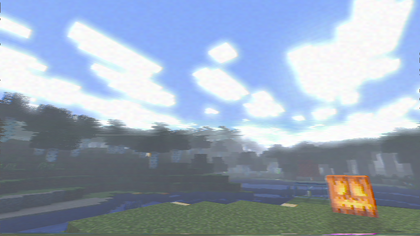

# static-shader
shader for minecraft that adds vhs effect, soft shadows, bloom, wavy water.
Attempting to make the visuals like those old photos taken in PSP/original iphone.

Planning to add another type of bloom(call of duty bloom) and keep the original blur for daytime
Also want to modify the cloud and sky rendering later and add user configurable options (and pre-made themes).
Also need to add tonemapping and water reflections.

Oh and need to add dynamic lighting(for torches that you can hold and stuff)

## how to use
tested on:
mc 26.1.2
iris fabric 1.10.9
sodium 0.8.9 

You can download iris from their https://irisshaders.dev/ 

then download the shader zip and put it in the shaderpacks folder in the minecraft folder.

